# Sowaka HRMS — PRD and Architecture Flow

> Product/technical map of the current implementation, reviewed 3 August 2026. “Planned” means a visible placeholder or a reserved contract, not a committed delivery date.

## Graphical overview

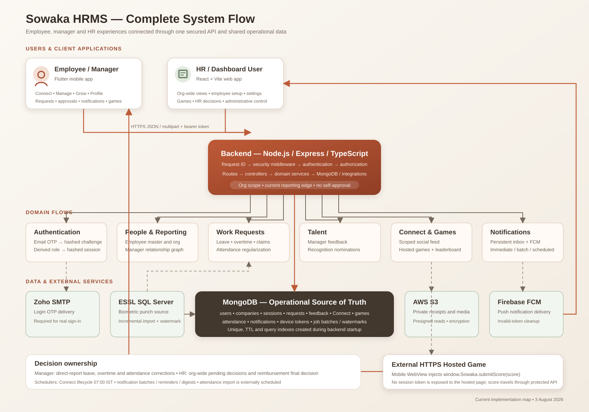

The editable standalone asset is `docs/sowaka-system-flow.svg`. The diagrams below break the same architecture into individual technical flows.

## 1. Product intent

Sowaka provides one authenticated employee experience and one restricted HR control plane over shared organizational data. Employees manage work requests and engagement; managers handle direct-report workflows; selected HR/dashboard users see the whole organization and may administer or override defined processes.

### Personas and access

| Persona | Access source | Primary outcomes |
|---|---|---|
| Employee | Registered active `users` record | Connect, personal attendance/history, leave/overtime/reimbursement submission, Grow/profile |
| Manager | Derived by having one or more direct reports | Employee access plus team feedback, recognition and approval inboxes |
| HR/dashboard user | Explicit `dashboardAccess=true`; independent of role | Org-wide dashboard, employee creation, settings, games, HR-only/override decisions |
| Leadership | Explicit `isLeadership=true` | Special no-manager behavior; approval-gated requests are restricted |

## 2. System context

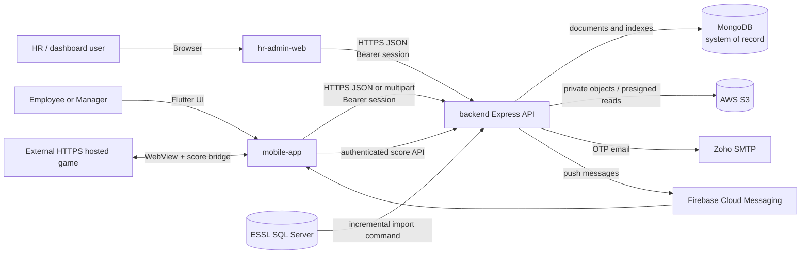

Trust boundaries:

- Clients are untrusted; all identity, org and approval rules must be enforced in backend services.
- Hosted games receive no bearer token; only the native WebView bridge can submit a score.
- SQL Server is inbound-only for attendance imports.
- S3 objects are private; clients receive presigned receipt URLs rather than credentials.

## 3. Container architecture

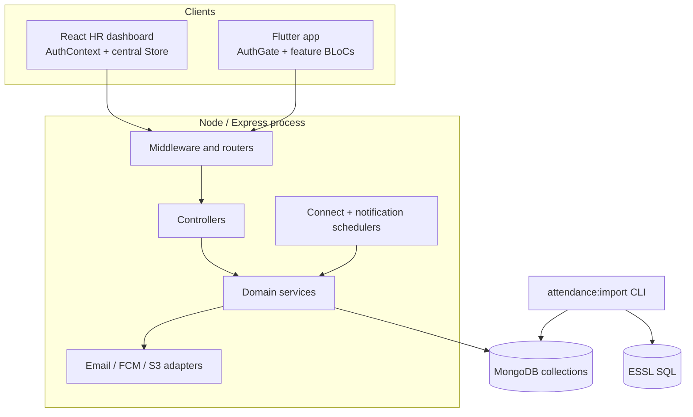

## 4. Core identity and authorization flow

```mermaid
sequenceDiagram
    actor U as User
    participant C as Web or Mobile
    participant A as Auth API
    participant D as MongoDB
    participant E as Zoho SMTP

    U->>C: Enter registered work email
    C->>A: POST /auth/request-otp
    A->>D: Verify active user; upsert hashed OTP challenge
    A->>E: Send six-digit OTP
    U->>C: Enter OTP
    C->>A: POST /auth/verify-otp
    A->>D: Validate hash, expiry and attempts
    A->>D: Derive manager role from direct reports
    A->>D: Store hashed random session token
    A-->>C: Raw bearer token + user profile
    C->>A: Protected request with bearer token
    A->>D: Find unexpired token hash and active user
    A-->>C: Org/role/scope-checked result
```

Authorization decision order:

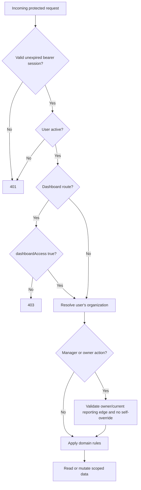

## 5. Feature map and status

| Capability | Mobile | HR web | Backend | Status |
|---|---:|---:|---:|---|
| Email OTP/session | Yes | Yes | Yes | Implemented |
| Employee directory/create | Limited profile/team use | Yes | Yes | Create/list implemented; full edit/lifecycle admin incomplete |
| Reporting relationships | Consumed | Partial at employee creation | Yes | APIs implemented; full admin UX absent |
| Leave/balance/approval | Yes | Org list + override | Yes | Implemented |
| Overtime/approval/settings | Yes | Org list + override/settings | Yes | Implemented |
| Reimbursement/receipts | Submit/history | HR decision | Yes | Implemented; final decisions are HR-only |
| Attendance/punch calendar | Yes | Placeholder nav | Import/API | Employee/manager implemented; HR module absent |
| Attendance regularization | Employee + manager | No | Yes | Implemented |
| Manager feedback | Yes | Org reporting | Yes | Implemented; web reminders simulated |
| Recognition nominations | Yes | No dedicated module | Yes | Manager flow implemented |
| Connect feed/lifecycle | Yes | Game publishing affects feed | Yes | Implemented |
| Hosted games/leaderboard | Yes | Yes | Yes | Implemented |
| Push + in-app inbox | Yes | No | Yes | Implemented for listed producers; reserved flows remain |
| Holidays | Consumed | Settings/maintenance | Yes | Implemented |
| Onboarding, Exit, Payroll, Org chart | No complete flow | Placeholder | Partial user fields only | Planned/not implemented |
| Attendance reports, campaign/survey scheduling | Destination contract only | No | Missing source domains | Planned/not implemented |

## 6. Request and approval state machine

Leave, overtime and attendance regularization share the essential decision pattern. Reimbursement differs because HR, not the manager endpoint, makes the final decision.

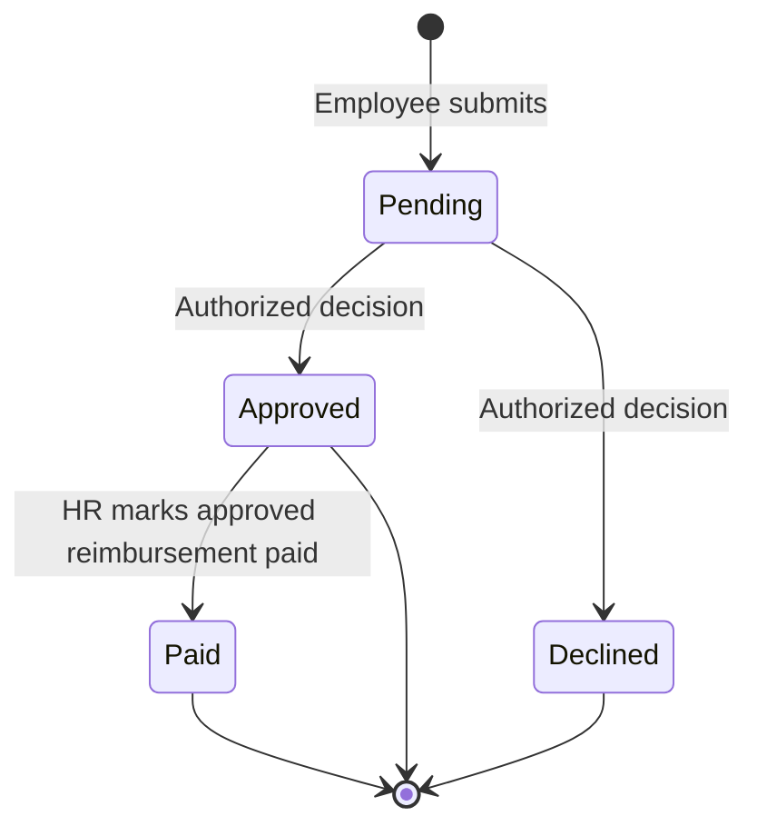

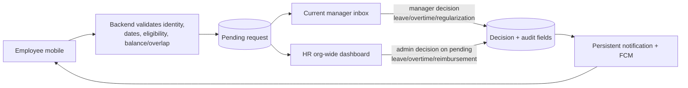

Rules that must remain invariant:

- Submitter is derived from the bearer session.
- Manager authorization uses the current reporting relationship.
- Organization boundaries apply to every dashboard list/decision.
- A dashboard user cannot override their own request.
- Decision actor, role, note and timestamp are stored where the model supports them.
- Working days use company week-offs and applicable holidays.

## 7. Attendance data flow

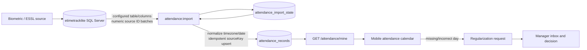

Operational requirement: schedule `attendance:import` outside the API process and alert on failures/stale watermarks.

## 8. Connect, games and engagement flow

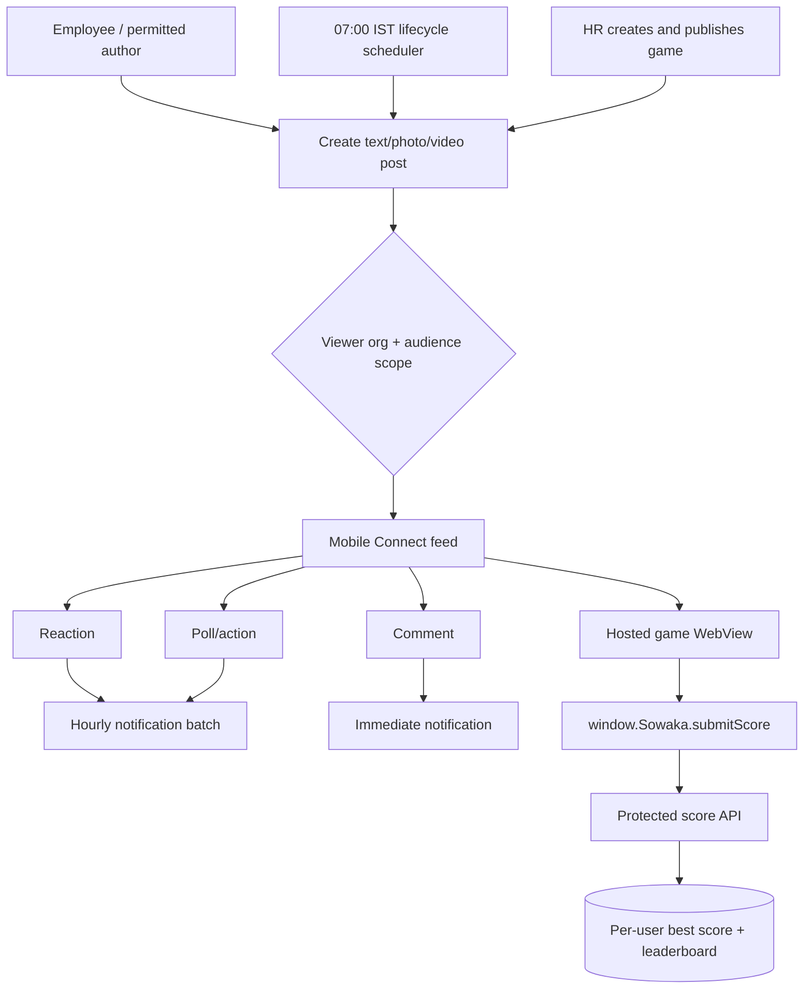

Media path:

- Connect photo: S3 when configured, otherwise MongoDB byte fallback.
- Connect video: S3 required.
- Reimbursement receipt: private S3 required; read via presigned URL.

## 9. Notification architecture

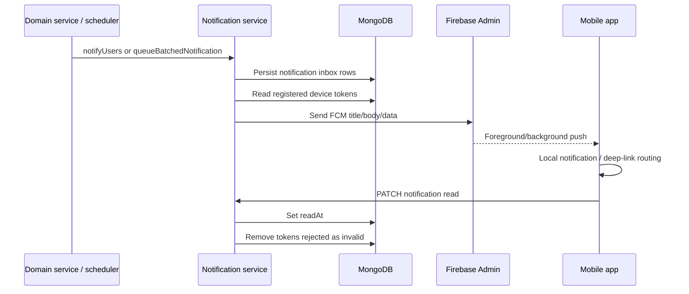

All push payloads contain `scenario` and `destination`; entity IDs are strings. If a target entity is gone, mobile should open the parent feature. The definitive destination table is in `docs/notifications.md`.

## 10. Primary user journeys

### Employee journey

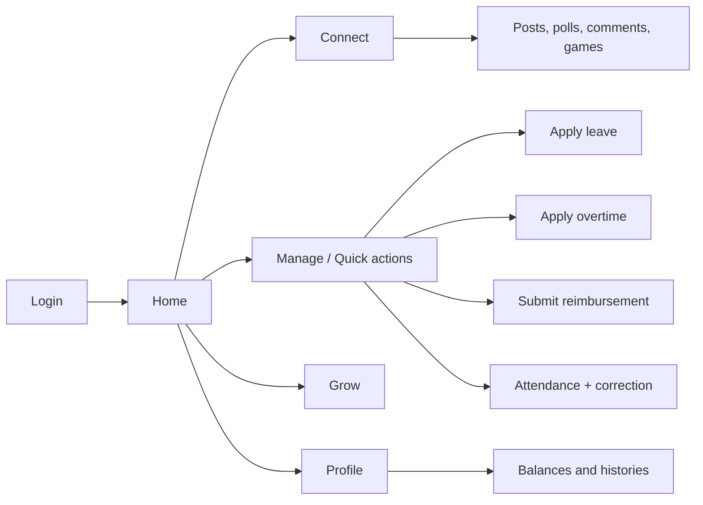

### Manager journey

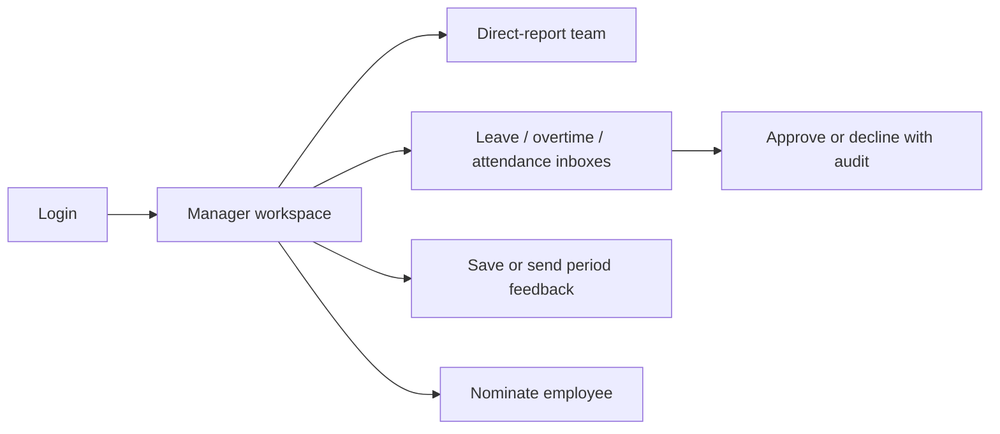

### HR journey

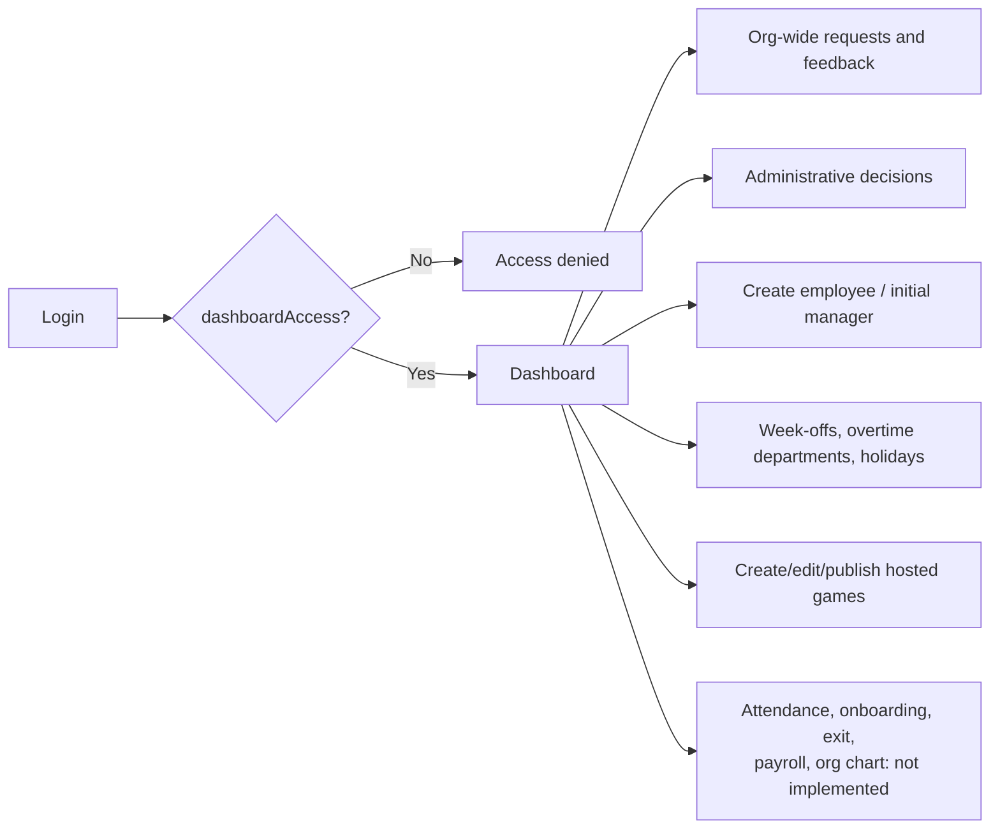

## 11. Non-functional requirements implied by the design

### Security

- Production must disable OTP bypass and diagnostic notification endpoint.
- Store only hashed OTPs and session tokens server-side.
- Enforce org and relationship scope on every backend operation.
- Use private/encrypted object storage and short-lived presigned access.
- Keep credentials out of Git and rotate any exposed service-account material.
- Add rate limiting, secure mobile storage/web session strategy and durable audit logging before broad production rollout.

### Reliability and data integrity

- Unique indexes protect stable identities, source idempotency and one-record-per-period rules.
- Scheduled/lifecycle creation must remain idempotent through `systemKey` or equivalent keys.
- External integration failures must be logged with request/job context and safe to retry.
- Attendance watermark advancement must happen only after successful batch persistence.
- MongoDB backups and restore tests are required; these are operational, not currently codified.

### Performance

- Preserve indexed org/user/status/date access patterns.
- Avoid unbounded feed/inbox growth; introduce pagination before scale requires it (current APIs largely return lists).
- Keep web initial loads parallel, but move to per-view loading/pagination as datasets grow.
- Avoid duplicate mobile polling and scheduler instances when horizontally scaling the backend; distributed job ownership is not currently implemented.

### Observability

- Every HTTP request already receives a request ID and structured contextual logs.
- Production still needs centralized logs, error tracking, metrics, scheduler/import freshness alerts, FCM/SMTP failure alerts and SLOs.

## 12. Delivery roadmap from current state

### P0 — Safe ownership

- Audit/rotate secrets and the service-account-named file.
- Document actual production topology, access owners, backups and release/rollback.
- Disable production bypass/test flags.
- Establish CI and core authorization/integration tests.

### P1 — Contract and operational maturity

- Define OpenAPI/shared schemas and remove client/server contract drift.
- Add rate limits, audit event collection, secure client token storage and monitoring.
- Automate and monitor attendance imports and make schedulers safe under multiple backend replicas.
- Add pagination to org-wide, feed and notification lists.

### P2 — Complete visible product promises

- Decide/build or remove placeholder Attendance HR, Onboarding, Exit, Payroll and Org chart navigation.
- Implement persistent feedback reminders.
- Add reporting-relationship management UI and employee edit/lifecycle management.
- Implement the missing domain sources behind reserved notification destinations.

## 13. Acceptance criteria for architecture changes

A feature is integrated only when:

1. Its persona and authorization rules are explicit and server-enforced.
2. Its data ownership, collection/indexes and lifecycle are documented.
3. Mobile/web consumers use a versioned or validated API contract.
4. Loading, empty, error, retry and unauthorized states are handled.
5. External side effects are retry-safe and observable.
6. Notifications include a tested parent fallback and deep-link payload.
7. Tests cover happy path, cross-org access, wrong manager, self-action and invalid transition.
8. Deployment configuration, secrets and rollback impact are recorded in the handover.

For detailed code locations, environment variables, API endpoints, operational commands and risks, see `docs/PROJECT_HANDOVER.md`.
